# Projeto de PO-235

Este documento irá apresentar um passo a passo estabelecendo padrões de contribuição para o projeto. Os padrões de contribuição envolvem boas práticas relacionadas à versionamento e sobre nossa pipeline de CI/CD. Esta documentação já considera que o ambiente está configurado e o repositório clonado.

## Padrões de Uso do Git no Projeto

Primeiramente, vamos nos certificar de que a branch master está atualizada. Para isso, execute o seguinte comando no seu terminal:

```
git pull
```


Esse comando irá atualizar a sua branch master de acordo com a branch master remota, garantindo que o seu repositório está atualizado de acordo com a última versão publicada.

### Criação de branch

Com a master atualizada, podemos criar nossa branch e trabalhar em nossa task. Seguindo as boas práticas de desenvolvimento, vamos criar uma branch por task desenvolvida. 

1. As branches seguirão uma organização simples usando prefixos _feature/_ e _fix/_. Se sua branch adicionar uma funcionalidade nova, ela deverá ter o prefixo _feature/_, caso sua branch faça uma correção ou exclusão de alguma funcionalidade, ela deverá ter o prefixo _fix/_. 

2. Para criar uma branch, vamos usar como referência o nome da sua task. Por exemplo:

    <p>
    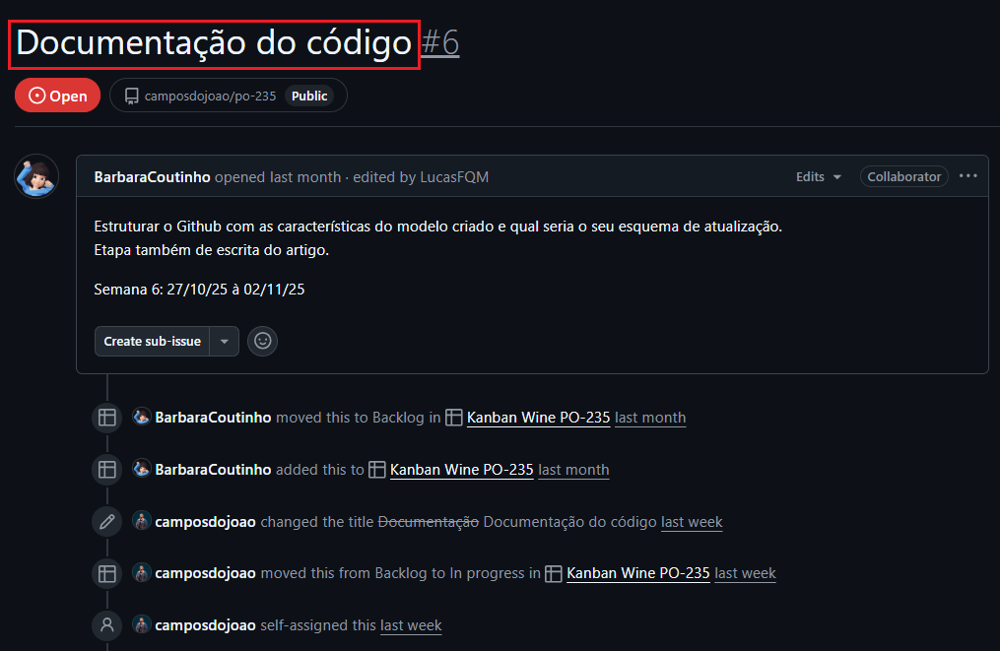
    </p>

    Essa task diz respeito à criação da documentação do código, então o nome dela será `feature/documentacao-do-codigo`. Dito isso, para criar uma branch (usando essa como exemplo), esse seria o comando:


    ```
    git checkout -b "feature/documentacao-do-codigo"
    ```

    Esse comando retornará o seguinte:
    <p>
    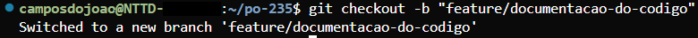
    </p>

    Após criar a branch, você está apto a desenvolver sua task livremente.

    ⚠️ _OBS: Se certifique de atualizar o nome da branch para o seu respectivo caso._

### Commit

Quando desejar fazer um commit, seja para "salvar um ponto no tempo" ou quando terminar sua task, seja desenvolvendo novas funcionalidade ou corrigindo já existentes, e após testar o código para ter certeza que está tudo funcionando corretamente, siga os seguintes passos:

1. Verifique os arquivos que foram adicionados/alterados no seu repositório através do comando abaixo:
    ```
    git status
    ```
    Esse comando irá retornar todos os arquivos que foram adicionados/alterados por você na sua branch. Algo assim será retornado:
    <p>
    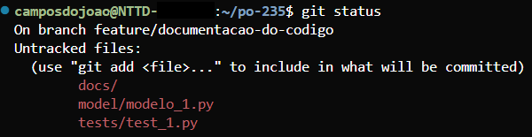
    </p>

    Nesse caso, temos a adição de uma pasta **_docs/_** e dois arquivos python com os respectivos caminhos: **_model/modelo_1.py_** e **_tests/test_1.py_**. Caso você deseje commitar todos os arquivos, digite o seguinte comando:

    ```
    git add .
    ```
    ⚠️ _OBS: certifique-se de que está na pasta do projeto._

    Caso não queira adicionar todos os arquivos que foram retornados pelo **_git status_**, é possível adicionar manualmente quais arquivos você quer commitar com o seguinte comando:

    ```
    git add <path_do_arquivo>
    ```

    Exemplo: caso você queira adicionar apenas o **_model/modelo_1.py_**, o comando ficará assim:

    ```
    git add model/modelo_1.py
    ```
    ⚠️ _OBS: certifique-se de que está na pasta do projeto._

    Depois que os arquivos forem adicionados, você pode verificar através do **_git status_** novamente e será retornado algo assim:

    <p>
    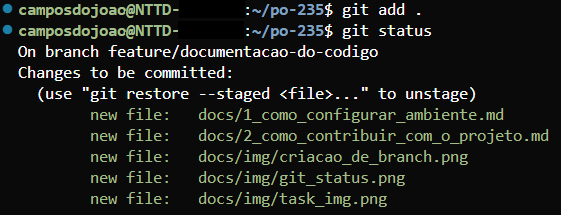
    </p>    

    Depois de adicionar os arquivos, você pode fazer o commit. Para fazer o commit, execute o comando abaixo:

    ```
    git commit -m "nome_do_commit"
    ```

    O nome do commit deverá ser uma descrição curta e concisa do que foi feito. Após fazer o commit, algo assim será retornado:

    <p>
    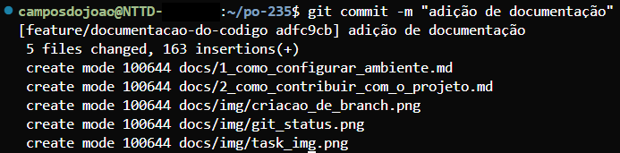
    </p>

### Git Push

Após concluir sua task e realizar os commits das suas alterações, é necessário enviar (fazer push) a sua branch local para o repositório remoto.
De forma geral, existem dois tipos de branches em um fluxo Git: branches locais e branches remotas.

Quando você cria uma nova branch e começa a trabalhar nela, ela existe apenas na sua máquina, ou seja, é uma branch local. Para que essa branch e suas alterações fiquem disponíveis no repositório remoto (no nosso caso o GitHub), é preciso publicá-la, executando o comando de push.
Esse processo “envia” a branch local para o servidor remoto, tornando-a acessível a outros desenvolvedores e integrando-a ao projeto principal.

Para fazer o push da sua branch, siga as instruções abaixo:

Se esse for o primeiro push que será feito na sua branch, execute o seguinte comando:

```
git push --set-upstream origin "nome_da_branch"
```

Caso já tenha feito o push antes seguindo o comando acima, pode executar somente:

```
git push
```

Após fazer o push, algo assim será retornado:

<p>
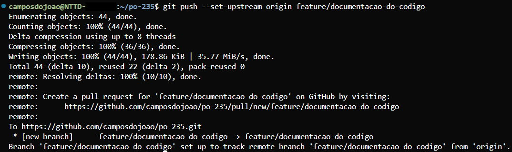
</p>

## Criação de PR (Pull Request)

Com o push feito, sua branch estará disponível no servidor remoto e você poderá criar um PR. O PR é a etapa em que você solicita a integração das alterações commitadas na sua branch à branch principal do projeto (master). Esse processo permite que o código seja revisado, validado e, se aprovado, mesclado ao repositório remoto. Para que seja possível o merge do PR, é necessário que pelo menos um integrante do time o aprove.

Para criar o seu PR, vá até o repositório do projeto: [Repositório do projeto](https://github.com/camposdojoao/po-235)

Você verá algo assim:

<p>
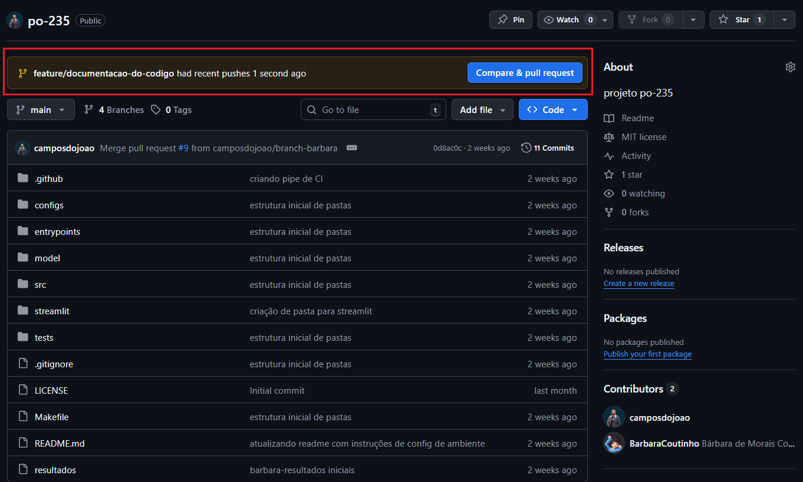
</p>

Clique em "**_Compare & pull request_**"

Ao clicar, você será redirecionado para esta página:

<p>
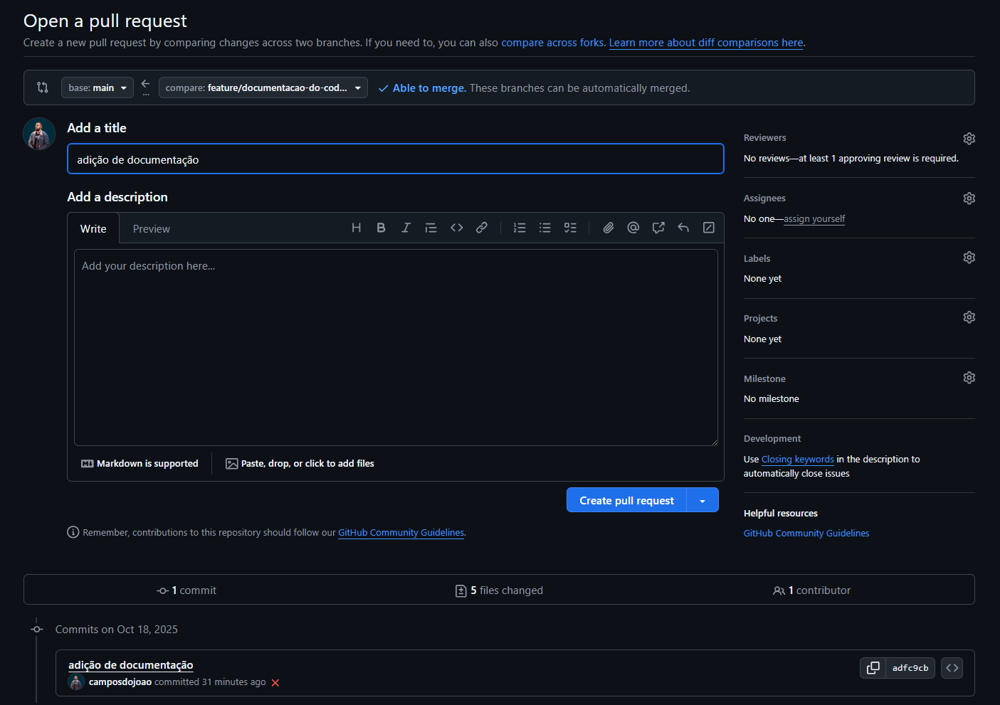
</p>

Nesta página, dê um título ao seu PR usando o nome da sua task. Nesse caso minha task se chama "Documentação do código", então esse será o nome do meu PR.

<p>
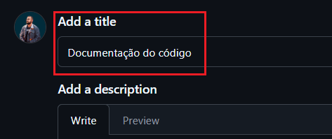
</p>

Ao rolar para baixo, caso você queira, você conseguirá visualizar todos os commit e as mudanças contidas nesses commits.

<p>
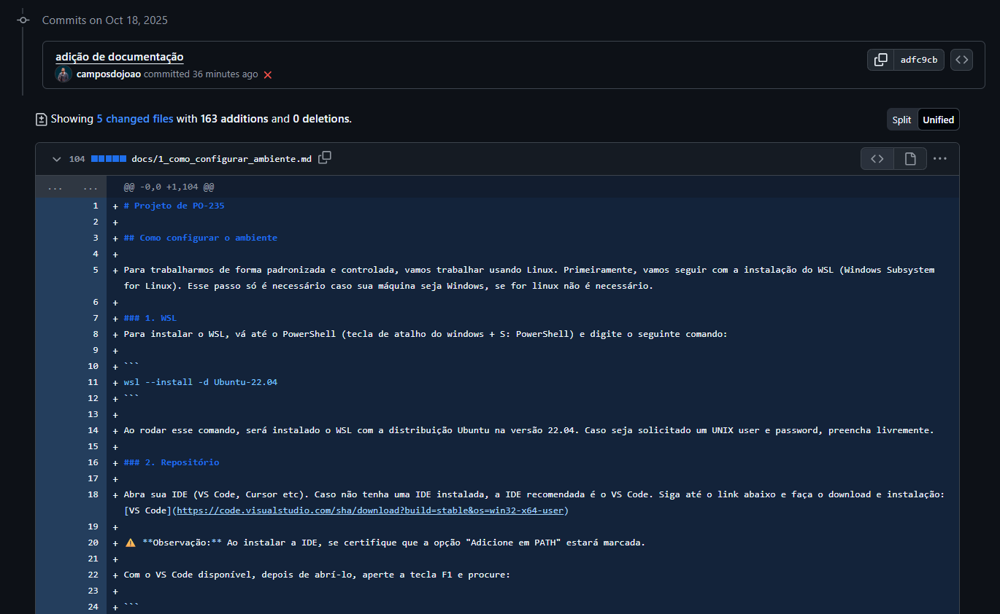
</p>

Por fim, você poderá criar o seu PR.

<p>
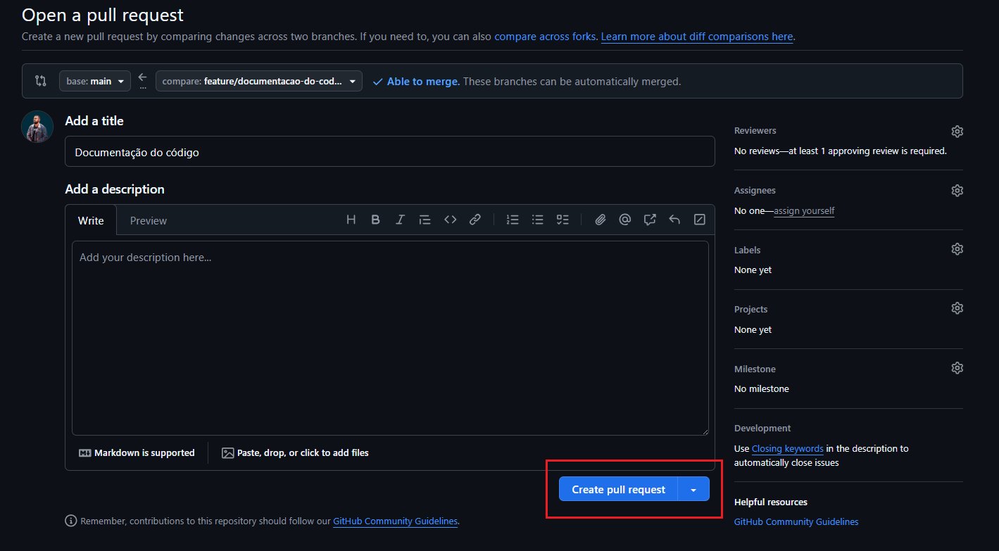
</p>

Depois de clicar em "**_Create pull request_**", você será redirecionado para a página do PR. Copie o link e envie para o time revisar. O link será algo como: `https://github.com/<seu_usuario_github>/po-235/pull/23`

## ⚠️ IMPORTANTE ⚠️

Ao criar o seu PR, o seu código irá acionar automaticamente a pipeline de CI (Continuous Integration). Essa pipeline executa algumas validações como testes unitários, testes de linting e se o nome da sua branch está seguindo o padrão do time (prefixo **_feature/_** ou **_fix/_**). Caso algumas dessas validações falhem, mesmo que o time aprove o PR, a pipeline de CI não permitirá mergear seu PR até que elas sejam corrigidas. 