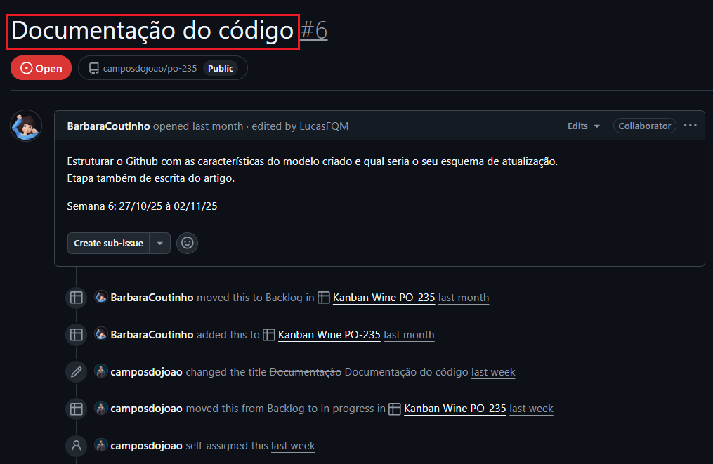
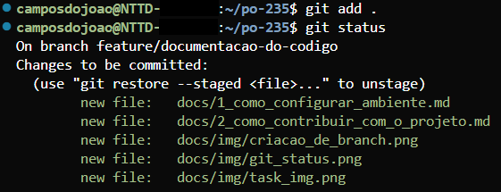
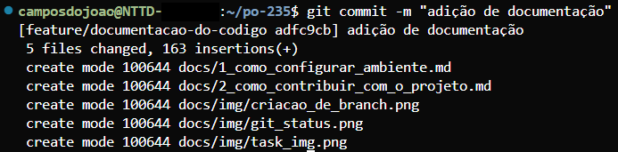
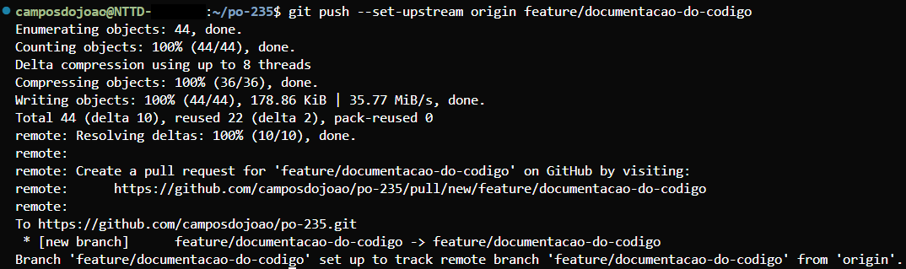
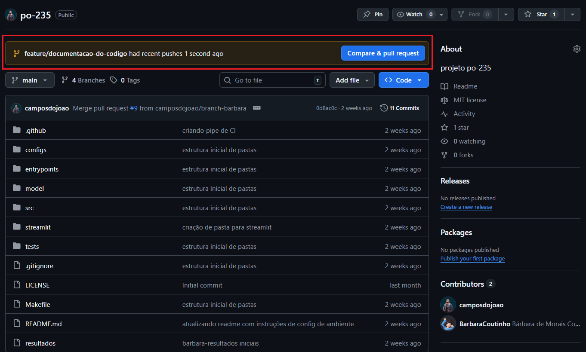
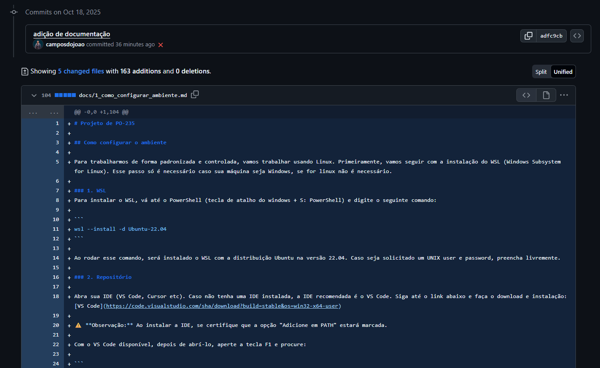

# PO-235 Project

This document presents a step-by-step guide establishing contribution standards for the project. The contribution standards involve best practices related to versioning and our CI/CD pipeline. This documentation assumes that the environment is configured and the repository is cloned.

## Git Usage Standards in the Project

First, let's ensure that the main branch is up to date. To do this, run the following command in your terminal:

```bash
git checkout main
```

After ensuring you're on main, run:

```bash
git pull
```

This command will update your main branch according to the remote main branch, ensuring your repository is up to date with the latest published version.

### Branch Creation

With main updated, we can create our branch and work on our task. Following development best practices, we'll create one branch per developed task.

1. Branches will follow simple organization using `feature/` and `fix/` prefixes. If your branch adds new functionality, it should have the `feature/` prefix; if your branch makes a correction or deletion of some functionality, it should have the `fix/` prefix.

2. To create a branch, we'll use your task name as reference. For example:

    <p>
    
    </p>

    This task concerns the creation of code documentation, so its name will be `feature/code-documentation`. That said, to create a branch (using this as an example), this would be the command:

    ```bash
    git checkout -b "feature/code-documentation"
    ```

    This command will return the following:
    <p>
    
    </p>

    After creating the branch, you're ready to develop your task freely.

    ⚠️ **NOTE**: Make sure to update the branch name for your respective case.

### Commit

When you want to make a commit, whether to "save a point in time" or when you finish your task, either developing new features or fixing existing ones, and after testing the code to make sure everything is working correctly, follow these steps:

1. Check the files that were added/modified in your repository using the command below:
    ```bash
    git status
    ```
    This command will return all files that were added/modified by you in your branch. Something like this will be returned:
    <p>
    
    </p>

    In this case, we have the addition of a **docs/** folder and two Python files with their respective paths: **model/modelo_1.py** and **tests/test_1.py**. If you want to commit all files, type the following command:

    ```bash
    git add .
    ```
    ⚠️ **NOTE**: Make sure you're in the project folder.

    If you don't want to add all files returned by **git status**, you can manually add which files you want to commit with the following command:

    ```bash
    git add <file_path>
    ```

    Example: if you only want to add **model/modelo_1.py**, the command will be:

    ```bash
    git add model/modelo_1.py
    ```
    ⚠️ **NOTE**: Make sure you're in the project folder.

    After the files are added, you can verify with **git status** again and something like this will be returned:

    <p>
    
    </p>    

    After adding the files, you can make the commit. To commit, run the command below:

    ```bash
    git commit -m "commit_name"
    ```

    The commit name should be a short and concise description of what was done. After committing, something like this will be returned:

    <p>
    
    </p>

### Git Push

After completing your task and making commits of your changes, it's necessary to push your local branch to the remote repository.

In general, there are two types of branches in a Git flow: local branches and remote branches.

When you create a new branch and start working on it, it only exists on your machine, i.e., it's a local branch. For this branch and its changes to be available in the remote repository (in our case, GitHub), it needs to be published by running the push command.

This process "sends" the local branch to the remote server, making it accessible to other developers and integrating it into the main project.

To push your branch, follow the instructions below:

If this is the first push on your branch, run the following command:

```bash
git push --set-upstream origin "branch_name"
```

If you've already pushed before following the command above, you can just run:

```bash
git push
```

After pushing, something like this will be returned:

<p>

</p>

## Creating a PR (Pull Request)

With the push done, your branch will be available on the remote server and you can create a PR. The PR is the stage where you request the integration of changes committed in your branch to the project's main branch (main). This process allows the code to be reviewed, validated, and, if approved, merged into the remote repository. For the PR to be mergeable, at least one team member must approve it.

To create your PR, go to the project repository: [Project Repository](https://github.com/camposdojoao/po-235)

You'll see something like this:

<p>

</p>

Click on "**Compare & pull request**"

When you click, you'll be redirected to this page:

<p>

</p>

On this page, give your PR a title using your task name. In this case, my task is called "Code Documentation", so this will be my PR name.

<p>

</p>

When you scroll down, if you want, you'll be able to view all commits and the changes contained in those commits.

<p>

</p>

Finally, you can create your PR.

<p>

</p>

After clicking "**Create pull request**", you'll be redirected to the PR page. Copy the link and send it to the team for review. The link will be something like: `https://github.com/<your_github_username>/po-235/pull/23`

## ⚠️ IMPORTANT ⚠️

When you create your PR, your code will automatically trigger the CI (Continuous Integration) pipeline. This pipeline performs some validations such as unit tests, linting tests, and checks if your branch name follows the team's standard (`feature/` or `fix/` prefix). If any of these validations fail, even if the team approves the PR, the CI pipeline won't allow merging your PR until they're fixed.

## Code Review Best Practices

1. **Write Clear Descriptions**: Explain what changes were made and why
2. **Keep PRs Small**: Smaller PRs are easier to review
3. **Test Before Creating PR**: Ensure all tests pass locally
4. **Respond to Feedback**: Address reviewer comments promptly
5. **Update Your Branch**: Keep your branch up to date with main

## Commit Message Guidelines

Follow these patterns for commit messages:

- `feat: add new feature` - For new features
- `fix: correct bug in X` - For bug fixes
- `docs: update documentation` - For documentation changes
- `test: add tests for Y` - For test additions
- `refactor: improve Z code` - For code refactoring
- `chore: update dependencies` - For maintenance tasks

## Branch Naming Conventions

- `feature/feature-name` - For new features
- `fix/bug-description` - For bug fixes

Examples:
- `feature/wine-quality-prediction`
- `feature/streamlit-interface`
- `fix/model-training-error`
- `fix/data-preprocessing-bug`

## CI/CD Pipeline

The CI pipeline runs automatically on:
- Pull requests to `main`
- Pushes to `feature/**` and `fix/**` branches

### What the CI Pipeline Checks:

1. **Unit Tests**: All tests must pass
2. **Code Coverage**: Minimum 75% coverage required
3. **Linting**: Code must follow style guidelines
4. **Branch Naming**: Must follow `feature/*` or `fix/*` pattern

### CD Pipeline

The CD (Continuous Deployment) pipeline runs when:
- A new tag is pushed (e.g., `v1.0.0`)

What it does:
1. Trains the model with 100% of available data
2. Creates a GitHub Release
3. Uploads model artifacts
4. Makes the model available for download

## Need Help?

If you have questions:
1. Check the [Environment Setup Guide](./1_environment_setup.md)
2. Review the [Project Architecture](./3_project_architecture.md)
3. Contact the project team

Happy contributing! 🚀

